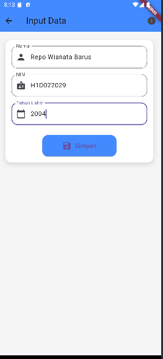
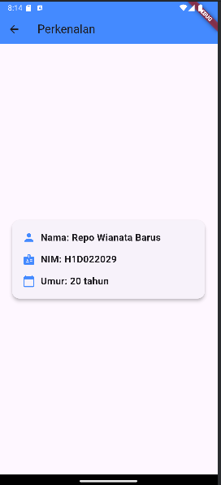

# Tugas Pertemuan 2

Nama : Repo Wianata Barus

NIM : H1D022029

Shift Baru: F

# Penjelasan Proses passing Data dari Form ke Tampilan 
## Komponen Utama
1. Form Input Data
   Form ini berfungsi untuk mengumpulkan informasi seperti nama, NIM, dan tahun lahir. Setelah
   pengguna mengisi form dan menekan tombol "Simpan", data yang diambil dari form tersebut akan
   dikirim ke layar berikutnya menggunakan Navigator.
a. Ambil Data dari TextFormField :
   Pada event tombol, data diambil dari controller (_namaController, _nimController, dan _tahunController).
b. Validasi Data: Form divalidasi untuk memastikan semua data sudah diisi dengan benar.
c. Navigasi ke Halaman TampilData: Dengan Navigator.of(context).push(), Flutter akan
   mendorong layar baru ke stack navigator, yang berarti layar baru ditampilkan di atas
   layar saat ini.
   Passing Data melalui Constructor: Data yang diambil dari form dikirim ke layar TampilData
   melalui constructor TampilData(nama: nama, nim: nim, tahun: tahun).
2. TampilData Widget
   Pada layar ini, Anda menggunakan widget TampilData yang merupakan widget stateless. Data yang diterima 
   dari layar sebelumnya disimpan dalam variabel nama, nim, dan tahun melalui constructor.
a. Menerima Data: Saat TampilData dibuat, Flutter mengambil data yang dikirim dari layar
   FormData melalui constructor TampilData(). Properti nama, nim, dan tahun berisi data yang diterima.
b. Menggunakan Data: Data tersebut kemudian digunakan untuk menghitung umur dan
   ditampilkan di UI menggunakan widget seperti Text.

## Alur passing data
1. FormData Widget:
   - Pengguna mengisi data di form.
   - Setelah tombol Simpan ditekan, data dikumpulkan dan divalidasi.
   - Aplikasi mengarahkan ke layar baru (TampilData) dengan membawa data yang dimasukkan pengguna melalui Navigator.
2. TampilData Widget:
   - TampilData menerima data tersebut melalui constructor.
   - Data ditampilkan di layar dengan menggunakan widget Text.
   
## Ilustrasi Proses Passing Data:
    `FormData Widget (pengumpulan data) ---> TampilData Widget (menampilkan data)`

## Kesimpulan:
   - Data dikumpulkan di FormData melalui form input.
   - Data dipassing ke TampilData melalui constructor saat navigasi.
   - Data diterima dan digunakan oleh widget TampilData untuk menampilkan hasilnya ke layar.
## Screenshot

